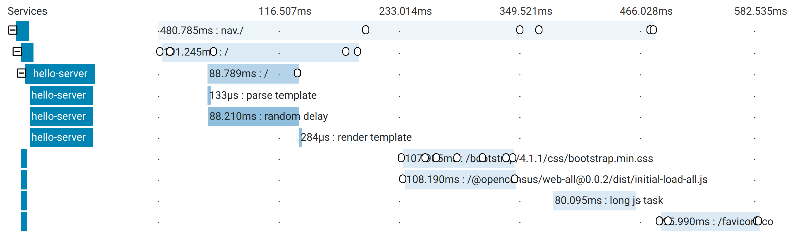
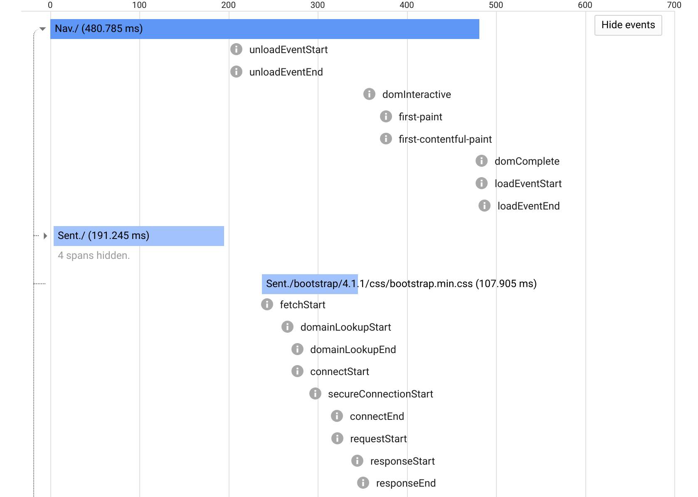

# OpenCensus - A stats collection and distributed tracing framework
[![Gitter chat][gitter-image]][gitter-url]
[![NPM Published Version][npm-img]][npm-url]
[![circleci][circleci-image]][circleci-url]
[![codecov][codecov-image]][codecov-url]
[![Known Vulnerabilities][snyk-image]][snyk-url]
[![Apache License][license-image]][license-url]

OpenCensus Web is an implementation of OpenCensus, a toolkit for collecting
application performance and behavior monitoring data. This library currently
generates traces for the initial page load of a site in the browser. It supports
sending the trace sampling decision and trace ID from the web server to the
browser client to enable latency debugging across the stack.

The library is in alpha stage and the API is subject to change.

Please join [gitter][gitter-url] for help or feedback on this project.

## Features

### Trace spans for initial load including server side HTML rendering

Here's a sample trace from OpenCensus Web that was exported to
[Zipkin][zipkin-url]. Notice that there is an overall `nav./` span for the user
navigation experience until the browser `load` event fires. There are also 
`/` spans for the client and server side measurements of the initial HTML load.
The server side spans also indicates how much time was spent parsing and 
rendering the template:



These spans are generated via the browser's
[Navigation Timing][navigation-timing-url] and
[Resource Timing][resource-timing-url] APIs. Notice also the `long js task`
span, which indicates a CPU-bound JavaScript event loop that took more than 50ms
as measured by the [Long Tasks][long-tasks-url] browser API.

### Span annotations for DOM and network events

The OpenCensus Web spans also include detailed annotations for DOM load events
like `domInteractive` and `first-paint`, as well as network events like
`domainLookupStart` and `secureConnectionStart`. Here is a similar trace
exported to [Stckdriver Trace][stackdriver-trace-url] with the annotations
expanded:



These annotations also comine from the
[Resource Timing API][resource-timing-url]. Note that for resources fetched via
CORS, you will need to specify the
[Timing-Allow-Origin header][timing-allow-origin-url].

### Export traces to Zipkin, Jaeger, Stackdriver, DataDog, Honeycomb and more

The OpenCensus Web library exports traces via the
[OpenCensus Agent][oc-agent-url], which can then export them to a variety of
trace backends. See the
[OpenCensus Agent/Collector exporter docs][oc-agent-exporter-url] for details.

## Usage

See the [examples/initial_load][examples-initial-load-url] folder for a full
example of how to use OpenCensus Web in an application. Below are
the steps that are currently needed to use it.

### 1. Deploy the OpenCensus agent to collect traces

The OpenCensus Web library currently only exports traces via the
[OpenCensus Agent][oc-agent-url], which can then export them to a trace backend
(e.g. Zipkin, Stackdriver). See this [example's README][initial-load-example-url]
for steps to run the agent locally or in the cloud.

When you run the agent in the cloud you will need to expose it to your
application via the internet. You may also to proxy the agent behind the
authentication or CSRF protection layer of your application to to only allow
traces to be written by authenticated end users.

### 2. Use the OpenCensus Web library code in your application

#### Using via a `<script>` tag

You can use OpenCensus Web via a `<script>` tag that makes uses of the
<unpkg.com> CDN that serves files from NPM packages.

The script tag should go before the `</body>`. You will also need to set the
`ocAgent` endpoint in a different `<script>` and may also specify the 
trace sample rate via an `ocSampleRate` global variable as well.
```html
...
  <script src="https://unpkg.com/@opencensus/web-scripts@0.0.3/dist/initial-load-all.js"
          integrity="sha384-VPY9XX7tiXeLekDPFXkfO2AqNpLTCNOzfXxVghzoVP05PXrG+wtHOW2kOP2ggO9o"
          async crossorigin="anonymous">
  </script>
  <script>
    // HTTP endpoint of the OpenCensus Agent you ran and exposed to the internet
    // in Step 1 above.
    ocAgent = 'https://example.com/my-opencensus-agent-endpoint';

    // Sample all requests for trace, which is useful when testing.
    // By default this is set to sample 1/10000 requests.
    ocSampleRate = 1.0; 
  </script>
</body>
```

You can also host the `initial-load-all.js` bundle from your own site. For
docs on how to build the bundle see the
[@opencensus/web-scripts readme][package-web-scripts].

#### Using as NPM dependency in existing JS build

If you already have a JS build pipeline using e.g. webpack or similar, you can 
do `npm install @opencensus/web-initial-load`, and then set the configuration variables
and trigger the recording and exporting of the initial load spans as follows:

```js
import { exportRootSpanAfterLoadEvent } from '@opencensus/web-initial-load';

window.ocAgent = 'https://example.com/my-opencensus-agent-endpoint';
window.ocSampleRate = 1.0; // Sample at 100% for test only. Default is 1/10000.

// Send the root span and child spans for the initial page load to the
// OpenCensus agent if this request was sampled for trace.
exportRootSpanAfterLoadEvent();
```

### 3. Optional: Send a trace parent and sampling decision from your server

OpenCensus Web also supports connecting the server side spans for the initial
HTML load with the client side span for the load from the browser's timing API.
This works by having the server send its parent trace context (trace ID, span ID
and trace sampling decision) to the client.

Because the browser does not send a trace context header for the initial page
navigation, the server needs to fake a trace context header in a middleware and
then send that trace context header back to the client as a global `traceparent`
variable. The `traceparent` variable should be in the
[trace context W3C draft format][trace-context-url]. For example:

```html
  ...
  <script src="https://unpkg.com/@opencensus/web-scripts@0.0.3/dist/initial-load-all.js"
          integrity="sha384-VPY9XX7tiXeLekDPFXkfO2AqNpLTCNOzfXxVghzoVP05PXrG+wtHOW2kOP2ggO9o"
          async crossorigin="anonymous">
  </script>
  <script>
    ocAgent = 'https://example.com/my-opencensus-agent-endpoint';
    // Set the `traceparent` in the server's HTML template code. It should be
    // dynamically generated server side to have the server's request trace ID,
    // a parent span ID that was set on the server's request span, and the trace
    // flags to indicate the server's sampling decision (01 = sampled, 00 = not
    // sampled).
    traceparent = '00-{{ServerTraceId}}-{{ServerParentSpanId}}-{{ServerTraceFlags}}';
    // We don't need to specify `ocSampleRate` since the trace sampling decision
    // is coming from the `traceparent` global variable instead.
  </script>
</body>
```

To see a full example of how the middleware to generate a trace context header
and send it back to the client, see the
[server.go][initial-load-example-server-go] file and the 
[index.html][initial-load-example-index-html] template in the
[examples/initial_load][initial-load-example-url] folder.

## Packages

The OpenCensus web library is composed of the following packages:

- **[@opencensus/web-types][package-web-types]**. This has automatically copied types from the [@opencensus/core][package-core] package of [OpenCensus Node][opencensus-node]. The types are copied because the `@opencensus/core` package has Node-specific dependencies that make it hard to depend on from browser-specific code.
- **[@opencensus/web-core][package-web-core]**. This has the core span and tracer implementation for web browsers. Currently the tracer assumes there is only one current root span for a given browser tab.
- **[@opencensus/web-exporter-ocagent][package-web-exporter-ocagent]**. This handles exporting spans to the [OpenCensus Agent][opencensus-service-url]
- **[@opencensus/web-instrumentation-perf][package-web-instrumentation-perf]**. This is code to convert the initial load resource waterfall timings from the browser [Navigation Timing API][navigation-timing-url] and [Resource Timing API][resource-timing-url] into  the spans for a trace of the overall initial load for a page.
- **[@opencensus/web-propagation-tracecontext][package-web-propagation-tracecontext]**. This provides utilities to serialize and deserialize a `traceparent` trace context header in the [W3C draft trace context format][trace-context-url]
- **[@opencensus/web-initial-load][package-web-initial-load]**. This package is in charge of generating the initial load page trace, plus the corresponding sampling decision for OpenCensus Web and 
storing a global initial load span context to be used by other packages. 
- **[@opencensus/web-scripts][package-web-scripts]**. This depends on all the other OpenCensus Web libraries and provides top-level functions for instrumenting the initial page load and exporting its spans to the OpenCensus Agent. It also provides WebPack builds for JS bundles that can be used in `<script>` tags.

## Useful links
- For more information on OpenCensus, visit: <https://opencensus.io/>
- For help or feedback on this project, join us on [gitter][gitter-url]

## Versioning

This library follows [Semantic Versioning][semver-url].

**GA**: Libraries defined at a GA quality level are stable, and will not introduce
backwards-incompatible changes in any minor or patch releases. We will address issues and requests
with the highest priority. If we were to make a backwards-incompatible changes on an API, we will
first mark the existing API as deprecated and keep it for 18 months before removing it.

**Beta**: Libraries defined at a Beta quality level are expected to be mostly stable and we're
working towards their release candidate. We will address issues and requests with a higher priority.
There may be backwards incompatible changes in a minor version release, though not in a patch
release. If an element is part of an API that is only meant to be used by exporters or other
opencensus libraries, then there is no deprecation period. Otherwise, we will deprecate it for 18
months before removing it, if possible.

**Alpha**: Libraries defined at an Alpha quality level can be unstable and could cause crashes or data loss. Alpha software may not contain all of the features that are planned for the final version. The API is subject to change.

## License

Apache 2.0 - See [LICENSE][license-url] for more information.

[circleci-image]: https://circleci.com/gh/census-instrumentation/opencensus-web.svg?style=shield
[circleci-url]: https://circleci.com/gh/census-instrumentation/opencensus-web
[codecov-image]: https://codecov.io/gh/census-instrumentation/opencensus-web/branch/master/graph/badge.svg
[codecov-url]: https://codecov.io/gh/census-instrumentation/opencensus-web
[examples-initial-load-url]: https://github.com/census-instrumentation/opencensus-web/tree/master/examples/initial_load
[gitter-image]: https://badges.gitter.im/census-instrumentation/lobby.svg
[gitter-url]: https://gitter.im/census-instrumentation/lobby?utm_source=badge&utm_medium=badge&utm_campaign=pr-badge&utm_content=badge
[initial-load-example-index-html]: https://github.com/census-instrumentation/opencensus-web/blob/master/examples/initial_load/index.html
[initial-load-example-server-go]: https://github.com/census-instrumentation/opencensus-web/blob/master/examples/initial_load/server.go
[initial-load-example-url]: https://github.com/census-instrumentation/opencensus-web/tree/master/examples/initial_load
[license-image]: https://img.shields.io/badge/license-Apache_2.0-green.svg?style=flat
[license-url]: https://github.com/census-instrumentation/opencensus-web/blob/master/LICENSE
[long-tasks-url]: https://w3c.github.io/longtasks/
[navigation-timing-url]: https://www.w3.org/TR/navigation-timing-2/
[npm-img]: https://badge.fury.io/js/%40opencensus%2Fweb-all.svg
[npm-url]: https://www.npmjs.com/package/@opencensus/web-all
[oc-agent-exporter-url]: https://github.com/census-instrumentation/opencensus-service/tree/master/exporter
[oc-agent-url]: https://github.com/census-instrumentation/opencensus-service
[oc-web-issue-url]: https://github.com/census-instrumentation/opencensus-web/issues/new/choose
[opencensus-node-url]: https://github.com/census-instrumentation/opencensus-node
[opencensus-service-url]: https://github.com/census-instrumentation/opencensus-service
[package-core]: https://github.com/census-instrumentation/opencensus-node/tree/master/packages/opencensus-core
[package-web-scripts]: https://github.com/census-instrumentation/opencensus-web/tree/master/packages/opencensus-web-scripts
[package-web-core]: https://github.com/census-instrumentation/opencensus-web/tree/master/packages/opencensus-web-core
[package-web-exporter-ocagent]: https://github.com/census-instrumentation/opencensus-web/tree/master/packages/opencensus-web-exporter-ocagent
[package-web-initial-load]: https://github.com/census-instrumentation/opencensus-web/tree/master/packages/opencensus-web-initial-load
[package-web-instrumentation-perf]: https://github.com/census-instrumentation/opencensus-web/tree/master/packages/opencensus-web-instrumentation-perf
[package-web-propagation-tracecontext]: https://github.com/census-instrumentation/opencensus-web/tree/master/packages/opencensus-web-propagation-tracecontext
[package-web-types]: https://github.com/census-instrumentation/opencensus-web/tree/master/packages/opencensus-web-types
[resource-timing-url]: https://www.w3.org/TR/resource-timing-2/
[semver-url]: http://semver.org/
[snyk-image]: https://snyk.io/test/github/census-instrumentation/opencensus-web/badge.svg?style=flat
[snyk-url]: https://snyk.io/test/github/census-instrumentation/opencensus-web
[stackdriver-trace-url]: https://cloud.google.com/trace/
[timing-allow-origin-url]: https://www.w3.org/TR/resource-timing-2/#dfn-timing-allow-origin
[trace-context-url]: https://www.w3.org/TR/trace-context/
[tsickle-url]: https://github.com/angular/tsickle
[zipkin-url]: https://zipkin.io/
